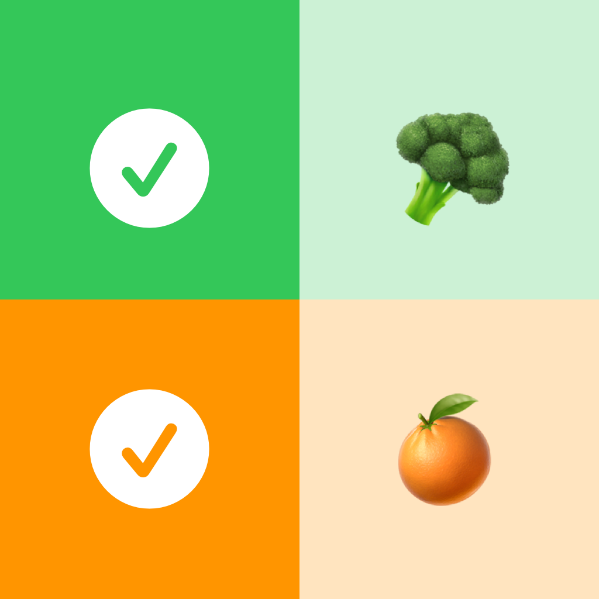

  

    
  

  

  <strong>Emoji Shopping List</strong> 
  Super simple &amp; fun shopping list that links emoji to products.

  

    
    
  

## Todo
- [x] Use The Composable Architeture
- [ ] Add Unit Tests
- [ ] Add RevenueCat for IAP
- [ ] Fastlane
- [ ] Github Actions workflows
- [ ] Localization
- [ ] Add all Emoji's
