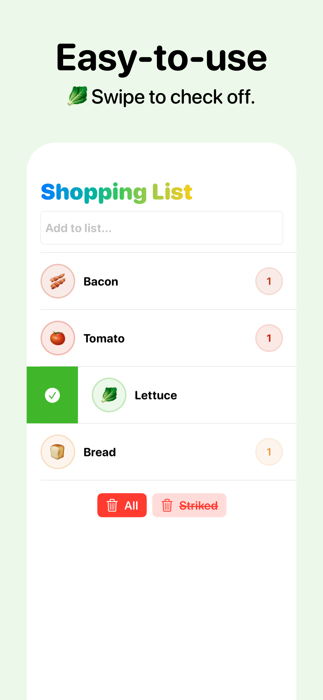
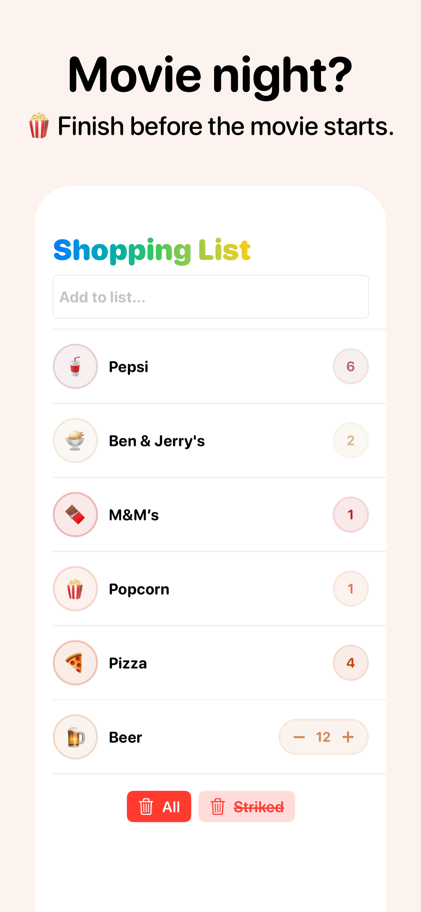
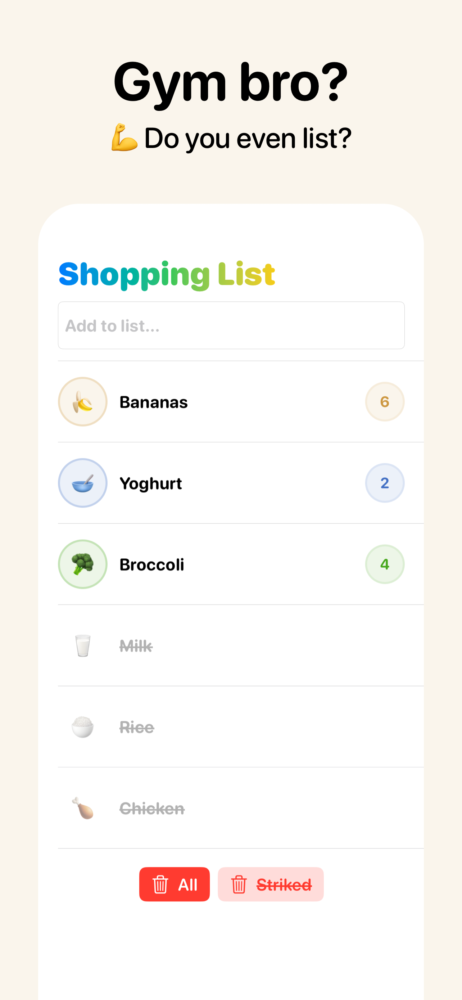
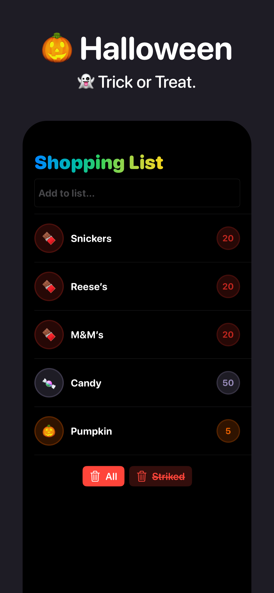

   

   <strong>Emoji Shopping List</strong> 
   🥦 Grocery shopping made fun!

   

---

   
   
   
   

---

Just for fun, my first go at a full `SwifUI` + [`Composable Architecture`](https://github.com/pointfreeco/swift-composable-architecture) application. 
- Available for free on the AppStore
- Using my [text-to-emoji](https://swiftpackageindex.com/WouterWisse/text-to-emoji) Swift Package
